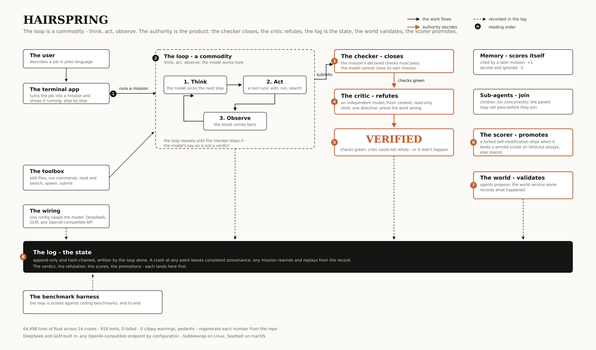

# HAIRSPRING

**A self-improving agent harness where the model never grades its own work.**

Agent harnesses run the same loop: think, act, observe, repeat. In most
of them the model decides when it is done, and the transcript is a diary
for whoever reads it later. Hairspring keeps the loop and moves the
authority out of the model:

- the checker closes the mission - the model's say-so is not a verdict
- the critic refutes: an independent model in a fresh context, with a
  read-only shell, and one directive - prove the work wrong. The
  mission passes when it can't
- the log is the state - append-only and hash-chained, written by the
  loop alone, so any mission replays from the record
- the world validates - agents propose; the world service records what
  happened
- the scorer promotes - a self-modification ships when it beats a
  pinned scorer on held-out assays
- memory scores itself - a note cited by a later mission earns +1, a
  note served and ignored earns -1

Nothing counts - no pass, no improvement, no memory - unless the
substrate verifies it.

<p align="center">
  
</p>

```console
$ hairspring run --goal "write hello.txt containing hello" --dir ./hs-demo
> term.exec      cat > work/.hs/checks ...          ok
> answer.submit  answer.txt                        ok
critic: {"blocking":"none","findings":[],"refuted":false}
{"outcome":"verified","passed":true,"steps":7,"model_calls":8}
```

A scripted model replays this demo with zero network and no API key -
the [offline trial](#offline-trial-no-api-key) runs it on a fresh
install.

## Run a mission in one minute

```sh
git clone https://github.com/tensorbend-instinct/hairspring.git
cd hairspring && ./install.sh
export HS_DEEPSEEK_API_KEY=<your key>
hairspring run --goal "fix the off-by-one in src/parser.rs" \
    --config ~/.config/hairspring/hairspring.toml \
    --dir ./hs-run --project-dir .
```

The mission runs sandboxed, declares its checks, submits, and closes
`verified` when the checks pass and the critic fails to refute the
work. Details and the fullscreen TUI: [Install](#install),
[Quickstart](#quickstart). No API key: the
[offline trial](#offline-trial-no-api-key) replays a graded mission
with zero network.

## Why the log

The record, not the prompt, is the source of truth. Plugins never
write the log; the loop is its only writer. A crash at any point
leaves consistent provenance on the streams, and any mission rewinds
and replays from the record.

| Number | Regenerate it |
|--------|---------------|
| 64,498 lines of Rust across 14 crates | `find crates -name '*.rs' \| xargs wc -l` |
| 918 tests, 0 failed | `cargo test --workspace --locked --no-fail-fast` |
| 0 clippy warnings, pedantic workspace-wide | `cargo clippy --workspace --all-targets` |
| 23 event kinds in the hash-chained log | `EventKind` in `crates/hs-core/src/lib.rs` |
| Offline demo mission closes `verified` | the offline trial below, on a fresh install |


## Install

```sh
git clone https://github.com/tensorbend-instinct/hairspring.git
cd hairspring
./install.sh
```

One command from a clone: it builds the release binaries, installs them
to `~/.local/share/hairspring/bin`, puts a `hairspring` command in
`~/.local/bin`, and writes a starter rig to
`~/.config/hairspring/hairspring.toml`. Rust is installed via rustup if
`cargo` is missing.

The sandbox confines tool calls by mechanism: bubblewrap on Linux
(install it first: `apt install bubblewrap` / `dnf install bubblewrap` /
`pacman -S bubblewrap`) and the kernel Seatbelt sandbox on macOS (via
`sandbox-exec`, which ships with the OS - the mechanism Bazel, Homebrew,
and Claude Code use). The startup preflight probes the platform sandbox
and says what is missing; an unconfined run is not the fallback.
Inside the sandbox, system dirs are read-only while the project root,
/tmp, and the standard toolchain caches stay writable: missions install
whatever toolchain they need into the workspace (uv/node/go/rustup
style downloads work - network is on), and archives should be extracted
with `tar --no-same-owner` (tar as sandbox-root otherwise floods one
chown warning per file).

## Quickstart

```sh
# Interactive fullscreen TUI - a first run with no flags writes the
# config with sane defaults and puts run state under
# ~/.local/share/hairspring/run ($XDG_DATA_HOME honored)
hairspring

# One-shot mission, in your project
hairspring run --goal "fix the off-by-one in src/parser.rs" --project-dir .
```

`--config` and `--dir` still override the defaults. Add a provider
without leaving the TUI: the `/models` picker ends with
`+ Add provider...`, and `/models add` (inline args like
`/models add openrouter` prefill the wizard) walks name, base URL,
model id, and key. The new entry is pickable in `/models` right away.

`--dir` holds the run state (streams, logs, memory); missions are
confined to the project root: `--project-dir`, default `<dir>/work`. On
a TTY, a run without `--project-dir` asks once with the default shown,
and the resolved root prints at startup. Before any
mission machinery starts, a readiness gate checks that the configured
default model has a credential: a terminal gets the guided setup
offered inline, a non-interactive run gets an actionable error - never
a mid-mission provider 400.

In the TUI, `:agents` shows live sub-agent delegations mid-run.

### Offline trial (no API key)

The install ships a scripted model that replays a fixed two-step demo
mission with zero network. Point it at the installed script and make it
the default:

```sh
export HS_SEQMODEL_SCRIPT=~/.local/share/hairspring/seqmodel-demo.jsonl
export HS_SCRIPTED_PROMPT_AWARE=1   # scripted model answers the verifier
                                    # audit honestly, not just replay lines
export HS_CRITIC_SCRIPT='tool:grep -q hello hello.txt|clean'
                                    # a deterministic stand-in for the
                                    # checker's phase-2 critic: it
                                    # probes the submission and reports
                                    # clean only when the probe passes
# in ~/.config/hairspring/hairspring.toml: comment `default = true` on the
# deepseek model, uncomment it on the scripted model (line ready)

hairspring run --goal "write hello.txt containing hello" \
    --config ~/.config/hairspring/hairspring.toml --dir ./hs-demo
```

The demo writes `hello.txt` under `./hs-demo/work`, declares its own
check, submits, and closes `verified` (checker green + verifier audit) -
a full graded mission with no provider. The critic stand-in is for this
demo only: live missions leave `HS_CRITIC_SCRIPT` unset so the critic
resolves from `HS_CRITIC_MODEL` (deepseek or glm) with a real provider
key, and an abnormal critic exit fails closed. Without
`HS_SEQMODEL_SCRIPT` the scripted model stays inert: missions that call
it get an error naming the variable, and live models are unaffected. A
missing live key is caught at startup by the readiness gate, which
names `hairspring setup` and the key env var; a wrong key fails the
mission with the provider's own error - check the run's `stderr/` logs
for a plugin's dying words.

## Architecture

| Crate | What it owns |
|-------|--------------|
| `hs-core` | Event schema, canonical encoding, hash chaining |
| `hs-log` | Per-stream segmented log, content-addressed payloads, fsync durability, torn-tail recovery, rewind/replay |
| `hs-kernel` | Plugin kernel: process isolation, NDJSON protocol, gated dispatch |
| `hs-loop` | The agent loop, REPL, fullscreen TUI, and the built-in tool/model plugins |
| `hs-swarm` | Async sub-agent delegation: concurrent children, atomic booking, join-at-close |
| `hs-goal` | Graded-mission rig: blind self-check, verifier, external grading |
| `hs-hashline` / `hs-applypatch` | Hash-anchored edit application |
| `hs-bench` / `hs-scorer` | Benchmarking and tiered scoring of the harness itself |
| `hs-selfmod` | Guarded self-modification loop |
| `hs-memory` / `hs-world` | Memory and world services |
| `hs-cli` | Log inspection (`hs-log-cli`) and test fixtures |

## Documentation

- [`docs/providers.md`](docs/providers.md) - DeepSeek and GLM are built in; any other OpenAI-compatible endpoint (OpenRouter, OpenAI direct, a local server) is configuration, not code.\n- [`docs/meta-harness.md`](docs/meta-harness.md) - filesystem-native outer-loop harness optimization with full source, traces, scores, and reflections.
- [`hairspring.example.toml`](hairspring.example.toml) - the annotated rig config: tools, models, the two-phase checker, delegation, budgets.

## Development

```sh
cargo build --workspace
cargo test --workspace --no-fail-fast
cargo clippy --workspace --all-targets   # held at zero warnings
```

The suite is strict RED-first: a behavioral change lands with a failing
test that pins it first. Test sessions, bench output, and proof
captures are runtime artifacts and are never committed.

## Citation

```bibtex
@software{hairspring,
  title  = {Hairspring: a self-improving agent harness},
  author = {{Tensorbend Instinct}},
  year   = {2026},
  url    = {https://github.com/tensorbend-instinct/hairspring}
}
```

## License

Proprietary; third-party notices in `THIRD_PARTY_NOTICES.md` and `LICENSES/`.

## Shared research and policy training

HAIRSPRING includes an Agora-derived shared research graph and Bellman Policy Optimization training primitives. The graph keeps typed results, failures, hypotheses, lineage, cross-author evidence, replaceable verification verdicts, and explore/exploit views on the same append-only authority log. BPO exposes the paper's critic-free grouped terminal-reward loss for model-training integrations; it is not misapplied to discrete prompt promotion. See [Agora and BPO](docs/agora-and-bpo.md).
